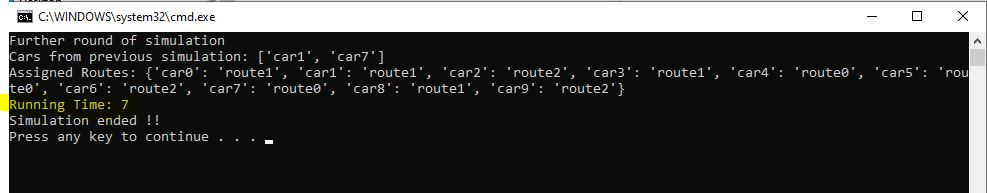

# Mobility Concept of ConnectiCity (**Ide3a**)
This is a script that runs on SUMO and was created to build the mobility concept on the ConnectiCity game. So there will be live traffic throughout the game. The traffic simulation will be updated every game round. During this update, it is built on the latest traffic situation from the previous game round.

To achieve this, 
- There is a defined number of vehicles in the city traffic.
- On the first game round, each vehicle chooses a route from the defined ones and starts moving through the city traffic.
- If an event occurs during that round, such as a flood, the roads in the area of the event are affected and the maximum vehicle speed on the roads is updated. 
- Thus, the traffic may continue to flow according to the new updated road conditions. 
- At the end of the game round, some vehicles may have completed their route, or may still be traveling on the route.
- When the next game round starts, if any vehicle completed its route in the previous round, it will choose a new route and continue moving in traffic.
- If there are still vehicles that have not completed their route, the vehicle continues to move in the traffic with the information from the previous round (position, speed, route, edge, lane, etc.). 

Thus, a more realistic city traffic can be achieved. Each game round represents a simulation over an equal time interval. 

Although the game concept is time-independent, this script creates a state of continuity so that the simulation can continue in accordance with this concept.

## How to run scenarios
### Installing python and dependencies
1) To install the latest Python, visit the [link](https://www.python.org/downloads/)
2) If you are a windows user and you haven't installed the necessary python packages yet, you can first run `install_python_requirements_WIN.bat`. A command window will open and install the required dependencies.

### Run the simulation to generate information
1) To quickly run the simulation, you can directly run `run_simulation.bat` file.
    
   **Note !**
      At this stage you should be aware that each time the simulation runs, it continues with the results of the previous simulation. If you want to start from the beginning, you need to delete the `csv`, `dump` and `stats` folders. This is because these folders store the data necessary for the simulation to continue from where it left off.

      Or you can click on `refresh_to_initial.bat` to automatically delete the relevant folders.

2) After `run_simulation.bat` has finished running, you will see `Si`. This completes one round of simulation and produces the results. You can close this window.
   
   

3) Each time you re-run the `run_simulation.bat` file, a new simulation will run over the previous simulation. You can keep track of the number of times it has been run over the initial simulation in the `Running Time: #` statement.

   
   
4)  In this window you can also see which routes have been assigned to the vehicles and which vehicles have continued from the previous round because they were unable to complete their routes.

   
 
### What information is generated
1) The `dump` folder collects the reports generated by SUMO, and is refreshed every simulation.
 
   
   
2) The `csv` folder contains the data generated from the data frames parse from these xml files. The main folder contains the data of the last simulation run.
    
   
  
3) The `csv\history` folder holds backups of the results of simulations run in the past. The numbers at the beginning of the file names represent `Running Times`.
       
   
  
4) Also, since `csv` files are not easy to understand at a glance, screenshots of short versions of data sets can be found under the `stats` folder.
          
   

5) For example, the file `05_df_dump_edges_xml.png` gives traffic data on all road segments (called edges in SUMO) defined on the map for simulation 5.
          
   

### What data can be useful for the ConnectiCity game
In the ConnectiCity game, it will be important to track the changes of city traffic in response to events and examine their possible effects, rather than the behavior of individual vehicles. For this reason, it may be useful to analyze some of the following data:
1) For example, information on traffic `density` and `speed` along a road segment (edge) is important. There is also data named `timeLoss`, which is calculated as a result of limitations that cause a vehicle to reduce its speed.
          
   

2) Carbon emission values from the traffic flowing on each road segment can be obtained.
             
   

3) In addition, the `position`, `speed`, `location`, etc. of individual vehicles used in the calculation of the next simulation can be accessed.
             
   
